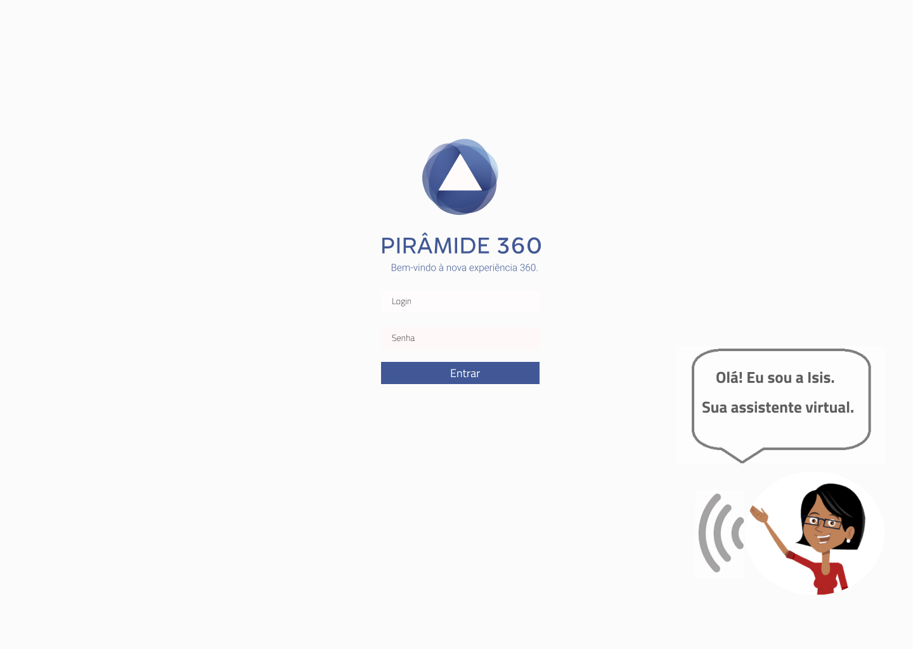

# Pirâmide 360 - ERP PREDITIVO

A empresa [Procenge](https://procenge.com.br/sobre-a-procenge/) criou um Hackaton com o funcionários. A proposta foi apresentar ideias de implantação de inteligência artificial na plataforma [PIRAMIDE 360.](https://procenge.com.br/solucao/erp-piramide-360/)

A Procenge é uma empresa de TI com 50 anos de mercado e faz parte do Porto Digital.

#### 🏆 O projeto criado ganhou em 1º lugar

## Como funciona?

A inteligência artificial aplicada como assistente virtual, aprendendo com o comportamento e os perfis de cada usuário. A I.A. vai interagir reconhecendo as atividades rotineiras de cada perfil, fazendo sugestões, pré-analises e envio programado de relatórios.

O design do projeto foi criado pelo [figma](https://www.figma.com/design/Tr6NBCaMO3S48dlx6uPwDg/ERP-PREDITIVO--PROCENGE?node-id=0-1&t=B4rFse3dfO28YVca-0) e passou pelas etapas de: Definição do problema, pesquisa de usuários, pesquisa dos concorrentes, definição dos objetivos, brainstorm e ideação, criação do protótipo de alta fidelidade.

## Apresentação

